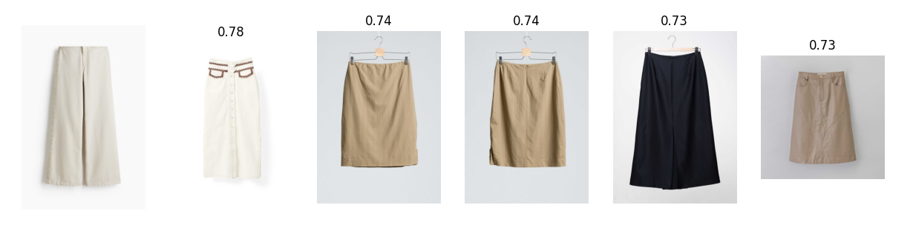

# Visual Product Recommendation

This repo contains a basic web app that allows users to upload images and performs image similarity search on a database of fashion images. There are also all the required scripts clean the dataset and build the database. I also explore indexing methods for vector databases and Aproximate Nearnest Neighbors search.

<a href="https://visual-product-recommendation-production.up.railway.app/" target="_blank">
    
</a>

## Model Summary

For this project, the purpose of the model is to perform feature extraction and embed images in vector space so we can compare them. For this purpose I think it makes the most sense to use a pre-trained model that has been trained on a vast dataset as I think training on this dataset would lead to features that don't generalise well. Using a pre-trained model means even if query images are of a different style or quality, features should still make sense and be meaningful for comparison with the main dataset.

For this project I chose to use [google/vit-base-patch16-224](https://huggingface.co/google/vit-base-patch16-224). The main reason being is I'm new to vision models and it was used in the example in the transformers documentation. The model was trained for image classification however we can simply skip the final task specific head and read outputs from the final pooling layer to extract features. Since the purpose of the model is just feature extraction I could use a large variety of models designed for more specific tasks and use extract the features in the same way. This makes the chose of model very flexible and I would like to explore this further in future experiments.

Once features are extracted from the model, embeddings can be compared via cosine similiarity, which measures the angle between two vectors. Then choosing a minimum threshold of 0.7, the input image is compared with every other image in the database and images above the threshold are cosidered similar enough to recommend.

## Example Results

See below an example of search results for the test image at `./test_image.avif`. The test image is first from the left, followed by the top 5 recommendations along with their cosine scores.



## Data Processing & Cleaning

The dataset consists of 50,000 images of vibrant clothing and is available on kaggle here [here](https://www.kaggle.com/datasets/kaborg15/vibrent-clothes-rental-dataset/data).

There is not much pre-processing required for this project as the transformers library handles a lot of this automatically. However the dataset does contain some empty images (size (1, 1)) so these have been removed from the dataset in production. There are also quite a lot of duplicate images, around 20,000 out of the 50,000 original images. To remove these I ran a python tool called [duplicate_images](https://pypi.org/project/duplicate_images/). This tool compares image hash values to identify duplicates, and writes the filenames to `dupes.txt`. The script to filter the duplicate and empty images is in `src/data.py`.

This leaves a dataset of around 30,000 images total.

## Improving Query Times

Originally I was simply loading the embeddings into a big list and iterating through calculating the cosine similarity between each vector and the query vector one by one. The first improvement I made to this is stacking the embeddings into one big tensor and computing the similarity vectorised. This speeds up queries dramatically, going from around 20 secs to 2 secs.

This also meant I could store the large tensor in one file instead of a bunch of individual files. This also speeds up loading time dramatically as it cuts down the I/O overhead to one file.

## Exploring ANN Methods

With the imrovements I made, query times were quite low already but I wanted to explore some more sophisticated methods. It also felt quite inefficient to calculate the cosine similarity on every query so I started researching how other recommendation systems work in production. I came across a familiy of techniques called Approximate Nearest Neighbors (ANN) and in particly Hierarchical Navigable Small Worlds (HNSW).

HNSW works by consructing an index structure, much like an index in a standard database that narrow down the search space for a given query vector. Vectors are added one by one and arranged in a graph structure by their relative inner product (equivilant to similarity for normalised vectors). The specifics of the method and implementation are beyond the scope of the project however I there are many libraries that implement the method, I'm using a popular one I found called nmslib.

I've kept the functionality for both methods, there's a selector in the frontend UI and the query time is displayed for easy comparison between methods. The HNSW method is considerably faster on all test images I've used. This comes at the cost of some accuracy and needing to define k.

## Usage

### Data

Start by downloading the dataset and copying the images folder to `data/` in the root directory

### Install Requirements

```bash
python3 -m venv .venv
source .venv/bin/activate
pip install -r requirements.txt
```

### Generating dupes.txt

The `dupes.txt` file containing duplicate image filenames is already included in the repo however if you want to generate `dupes.txt` yourself navigate to `data/images` and run

```bash
find-dups . --parallel --progress --hash-db hases.json --group > ../../dupes.txt
```

The `--group` option is the most important as this outputs the filenames in groups of like images, rather than pairs of duplicates, which is required for `src/data.py`

### Environment Variables

Start by copying the example file

```bash
cp .env.example .env
```

Set device accordingly i.e. cpu, cuda etc.

Set mode to setup if running the embedding pipeline, search if not.

### Run the Embedding Pipeline

You do not need to run this as the embeddings are already in the repo in `embeddings_stacked.pt` and images are accessed by name so the raw dataset will work fine. However if you want to remove dupes or generate the embeddings yourself, make sure mode is set to setup and run

```bash
python main.py
```

This script first builds the clean dataset by removing dupes and empty images, then generates embeddings for each image and saves them to disk, along with a large tensor containing all vectors stacked together. The script also demos a simple search example with `test_image.avif` although I'd reccomend using the web UI as the it's much nicer and has more functionality.

### Run the api

```bash
cd api
fastapi dev
```

Open `http://127.0.0.1:8000/` to use the web UI. There are controls for the method and k neighbors. See the query time for a comparison between methods.

## Future Improvements

There are quite a few instresting avenues to explore with this project. I'd start by increasing the dataset size, either artificially or by adding other datasets and seeing how the various methods scale. As part of that I'd also try other indexing methods as hnsw is just the first one I came across. I'd also explore different models as like I said the model choice is super flexible since it's used only for feature extraction.
